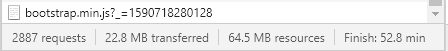

<h1 align="center"><b>RazerMoons Strips System</b></h1>

This is an FSX [Strips System](https://en.wikipedia.org/wiki/Flight_progress_strip) inspired by [Kermout's](https://kermout.us/) [fsATC Strips System](https://strips.fsatc.us/) (likely inspired by [Salad's](https://gitlab.com/milan44/) [Downwind Strips System](https://strips.wiese2.org/) or the other way around.), although it can be used for other flight games aswell.

As of writing this I couldn't find any open source flight simulator strips system so I decided to make my own (inspired by currently existing ones). Feel free to make suggestions to improve this project.

I am making this project using [XAMPP](https://www.apachefriends.org/) which has [cURL](https://curl.haxx.se/) ready to go, if you are using something else **YOU NEED TO INSTALL cURL**. It is used for the Discord OAuth2 Login and Registration system. Having the newest version of PHP would also help.

## **NOT FULLY COMPLETE**

## **Table of Contents**

- [ToDo](#TODO-)
- [Possible Future Additions](#Possible-Future-Additions-)
- [RazerMoon's Strips System](#RazerMoons-Strips-System-)
- [Kermout's Strips System](#Kermouts-Strips-System-)
- [Salad's Strips System](#Salads-Strips-System-)

## **ToDo** 📑

- [ ] Finish working version.
- [ ] Strips.
- [ ] Flight Plan creation and deletion.
- [x] Login and Registration system using Discord OAuth2, cURL and MySQL.
- [x] In-depth analysis of Kermout's Strips System
- [x] Basic layout with Bootstrap and jQuery integration.

## **Possible future additions** ❔

- [ ] In-depth analysis of Salad's Downwind Strips System.
- [ ] Messaging system.
- [ ] Strip docs similar to [Salad's system](https://strips.wiese2.org/help/) that use [PrettyDocs](https://themes.3rdwavemedia.com/bootstrap-templates/product/prettydocs-free-bootstrap-theme-for-developers-and-startups/) (maybe using [CoderDocs](https://themes.3rdwavemedia.com/bootstrap-templates/product/coderdocs-free-bootstrap-4-documentation-template-for-software-projects/)?).
- [ ] Username emoji support.
- [ ] Strips API.
- [ ] Suggested aircraft/aircraft from database selection.
- [ ] Airport chart information.
- [ ] Aircraft tooltip information.
- [ ] Separate table for currently active users.
- [ ] Admin accounts with the ability to activate other accounts.
- [ ] Airline information.
- [ ] Combine login and registration pages.
- [ ] Option to switch between dark and light mode.
- [x] Add live Bootstrap form [validation](https://getbootstrap.com/docs/4.5/components/forms/#validation).
- [x] Quick airport change.
- [x] Airport information.

## **Tweaks** 🔧

- [ ] *Maybe* change from MySQLi to PDO.
- [x] Change all MySQLi code to Object Oriented instead of Procedural.
- [x] Transfer all JavaScript to files.
- [ ] Use downloaded airline data from OpenFlights instead of using POST requests.
- [ ] Allow some special chars in the route and remarks field by using [MySQLi::real_escape_string](https://www.php.net/manual/en/mysqli.real-escape-string.php).
- [ ] Work on strip dynamic tooltip code (atc.js).
- [ ] Automatically log out a user after a period of inactivity (Task scheduler/CRON/MySQL scheduler?).
- [ ] Combine config and auth .php files into a single .env file.
- [ ] Give each user and plan a randomly generated ID instead of auto incrementing.
- [ ] Optimise for mobile.

# **RazerMoon's Strips System** 🌙

## *Not fully complete*

This is a constant work in progress, I started this project not knowing how to use PHP. My programming knowledge consisted of mainly NodeJS and Python. I initially thought about using NodeJS or maybe learning Go but decided against it because Kermout's system is entirely HTML, and a good starting point. Something similar to Salad's system is something I likely *won't* accomplish anytime soon because the level of coding present is quite high.

I decided to make this strips system because:

1. There is no other open source system (as of me writing this).
2. I want to see can I improve some of the flaws in Kermout's system (sorry Kermout, nothing personal).
3. I want to see can I eventually make a system as good as Salad's.

Accomplishing the first goal is being done already, the second goal is in progress. The third goal is gonna take a *long* time and likely a full move to NodeJS or Go, integration with Socket.io is be very likely.

* Using [AviationAPI](https://github.com/iccowan/AviationAPI_WWW) for Airport Information.

## Database structure

The MySQL database structure is shown below, by default the PHP script tries to connect to the "strips" database. Change the details in [config.php](scripts/config/config.php) if you want to use a different database.

The user accounts are stored in the **"users"** table.

Entry structure:

| id |  username | discriminator |       discord      |      created_at     | activated | loggedIn | airport | position |
|:--:|:---------:|:-------------:|:------------------:|:-------------------:|:---------:|:--------:|:-------:|:--------:|
| 36 | RazerMoon |      7589     | 162970149857656832 | 2020-06-01 12:27:34 |     1     |     0    |  KJFK   |  Tower   |
| AUTO_INCREMENT ||              |                    | current_timestamp() |     0     |     0    |         |          |

Use this MySQL query to set it up:

```sql
CREATE TABLE `users` (
	`id` INT(11) NOT NULL AUTO_INCREMENT COMMENT 'Storage ID',
	`username` VARCHAR(32) CHARACTER SET utf8mb4 COLLATE utf8mb4_general_ci NOT NULL COMMENT 'Discord Username without Discriminator',
	`discriminator` INT(4) NOT NULL COMMENT 'Discord Discriminator',
	`discord` VARCHAR(50) NOT NULL COMMENT 'Discord ID',
	`created_at` DATETIME NOT NULL DEFAULT CURRENT_TIMESTAMP COMMENT 'Date of registration',
	`activated` TINYINT(1) NOT NULL DEFAULT '0' COMMENT 'Is the account activated?',
	`loggedIn` TINYINT(1) NOT NULL DEFAULT '0' COMMENT 'Is the user logged in?',
	`airport` VARCHAR(4) CHARACTER SET utf8mb4 COLLATE utf8mb4_general_ci NOT NULL COMMENT 'The airport the user is controlling',
    `position` VARCHAR(10) CHARACTER SET utf8mb4 COLLATE utf8mb4_general_ci NOT NULL COMMENT 'The controllers position',
	UNIQUE KEY `discord` (`discord`) USING BTREE,
	PRIMARY KEY (`id`)
) ENGINE=InnoDB;
```

The flight plans are stored in the **"plans"** table.

Entry structure:

|       id       | callsign | aircraft | squawk | taltitude | rules | departure_icao | arrival_icao | altitude | route      | arrival_rw | departure_rw | departure_hdg | remarks    | scratchpad   | controller | controller_id      | created_at          |
|:--------------:|:--------:|:--------:|:------:|:---------:|:-----:|:--------------:|:------------:|----------|------------|------------|--------------|---------------|------------|--------------|------------|--------------------|---------------------|
|       12       |  UAL256  |   B747   |  1200  |    5000   |  VFR  |      KSAN      |     KJFK     | 20000    | Direct GPS | 22R        | 27           | 270           | New to FSX | Left circuit | Rasync     | 162970149857656832 | 2020-06-07 15:18:32 |
| AUTO_INCREMENT |          |          |        |           |       |                |              |          |            |            |              |               |            |              |            |                    | current_timestamp() |

Use this MySQL query to set it up:

```sql
CREATE TABLE `plans` (
	`id` INT(6) NOT NULL AUTO_INCREMENT COMMENT 'ID of the plan',
	`callsign` VARCHAR(10) CHARACTER SET utf8mb4 COLLATE utf8mb4_general_ci NOT NULL COMMENT 'Callsign of the aircraft',
	`aircraft` VARCHAR(4) CHARACTER SET utf8mb4 COLLATE utf8mb4_general_ci NOT NULL COMMENT 'Aircraft ICAO',
	`squawk` INT(4) NOT NULL,
	`taltitude` INT(5) NULL COMMENT 'Temporary altitude',
	`rules` VARCHAR(4) CHARACTER SET utf8mb4 COLLATE utf8mb4_general_ci NOT NULL COMMENT 'IFR, VFR etc.',
	`departure_icao` VARCHAR(4) CHARACTER SET utf8mb4 COLLATE utf8mb4_general_ci NOT NULL COMMENT 'Departing airport',
	`arrival_icao` VARCHAR(4) CHARACTER SET utf8mb4 COLLATE utf8mb4_general_ci NOT NULL COMMENT 'Arriving airport',
	`altitude` INT(5) NOT NULL COMMENT 'Cruise altitude',
	`route` VARCHAR(100) CHARACTER SET utf8mb4 COLLATE utf8mb4_general_ci NOT NULL COMMENT 'Direct GPS etc.',
	`arrival_rw` VARCHAR(3) CHARACTER SET utf8mb4 COLLATE utf8mb4_general_ci NULL,
	`departure_rw` VARCHAR(3) CHARACTER SET utf8mb4 COLLATE utf8mb4_general_ci NULL,
	`departure_hdg` INT(3) NULL,
	`remarks` VARCHAR(20) CHARACTER SET utf8mb4 COLLATE utf8mb4_general_ci NULL,
	`scratchpad` VARCHAR(20) CHARACTER SET utf8mb4 COLLATE utf8mb4_general_ci NULL,
	`controller` VARCHAR(32) CHARACTER SET utf8mb4 COLLATE utf8mb4_general_ci NULL COMMENT 'Username of controller',
	`controller_id` VARCHAR(50) CHARACTER SET utf8mb4 COLLATE utf8mb4_general_ci NULL,
	`created_at` DATETIME NOT NULL DEFAULT CURRENT_TIMESTAMP,
	UNIQUE KEY `controller_id` (`controller_id`) USING BTREE,
	PRIMARY KEY (`id`)
) ENGINE=InnoDB;
```

Use this MySQL query to insert an example flight plan.

```sql
INSERT INTO `plans` (
    `id`, 
    `callsign`, 
    `aircraft`, 
    `squawk`, 
    `taltitude`, 
    `rules`, 
    `departure_icao`, 
    `arrival_icao`, 
    `altitude`, 
    `route`, 
    `arrival_rw`, 
    `departure_rw`, 
    `departure_hdg`, 
    `remarks`, 
    `scratchpad`, 
    `controller`, 
    `controller_id`, 
    `created_at`
    ) VALUES (
        NULL, 
        'UAL256', 
        'B747', 
        '2204', 
        NULL, 
        'IFR', 
        'KJFK', 
        'KSAN', 
        '20000', 
        'Direct GPS', 
        NULL, 
        NULL, 
        NULL, 
        NULL, 
        NULL, 
        NULL, 
        NULL, 
        CURRENT_TIMESTAMP()
        ) 
```

## Testing checklist

After you finish setting up the database you should check if everything works as intended, perform the actions below to check if everything works:

* Register - You should get the **Registration successful!** message and a database table entry should be added with the user's details (*Check these*).
* Register *again* - You should get the message **Account not activated!**.
* Activate the account and Register *again* - You should now get the message **Account taken**.
* Login with fake ICAO (e.g. XKSS) - You should get the message **Airport not found!**.
* Login with valid ICAO (e.g. KJFK) - You should be redirected to Discord OAuth and then to the ATC page, the user's database table entry should now contain the **Airport ICAO**, their selected **Controller Position** and **LoggedIn should be set to 1**.
* Click on your Airport ICAO in the top right corner - You should get information about that airport.
* Change the airport using the dropdown - The user's airport value in the database should change to the new ICAO.
* Logout - The user's **LoggedIn should change to 0** and the **Airport and Position entries should become clear**.
* Logout - The user's **LoggedIn should change to 0** and the **Airport and Position entries should become clear**.
* File a plan - Check that the JavaScript correctly indicates what is not allowed in the fields, try entering some incorrect ICAO's etc. Check if the database entry matches the form details.

# **Kermout's Strips System** 🐸


## **General**

Kermout's system is a simple design built with Bootstrap, jQuery and (very likely) cURL.

This system was being used on the fsATC FSX server as a temporary replacement, check out their Discord [here.](https://discord.gg/a9tQuaM)

You can find Kermout on the fsATC Discord server above or the [Downwind Discord Server.](https://discord.gg/aqyyFNw). Here is his [website.](https://kermout.us/)

## **(Likely) General Structure**

    .
    ├── controller
    │   └── controller.php      # Where the magic happens
    ├── register
    │   └── register.php        # Registration page
    ├── login
    |   └── login.php           # Login page
    ├── api
    │   ├── change-squawk.php   # Called when changing squawk
    │   └── file-custom.php     # Files custom flight plan
    ├── functions
    │   ├── config
    │   │   └── config.php      # (Likely) holds database details
    │   ├── accept.php
    │   ├── add-header.php      # Adds custom controller header
    │   ├── delete-plan.php     # Deletes flight plan
    │   ├── edit.php            # Commits flight plan edit
    │   ├── handoff.php         # Hands off plan to other controller
    │   ├── release.php         # (Likely) removes flight plan ID from session
    │   ├── take.php            # (Likely) adds flight plan ID to session
    │   └── logreg.php          # Responsible for login and registration
    └── index.php               # Homepage
    └── plan.php                # Shows your current plan
    └── fetch-plan.php          # Used to get info about your plan, fetched every 15 seconds by plan.php
    └── logout.php              # Logs you out of controller.

## **Some screenshots of the actual structure**

| Functions | API | Config
:---------:|:-------------:|:------------:
 | | 

## **Issues**

The website is quite slow. I don't know if this is due to the code or the host, but optimising the code would make the process of being a controller a lot less painful. Switching to NodeJS or Go would also speed up the website, especially the actual strips system.

> Beware, I am new to PHP and jQuery. I might write that I think the way something being done on the website is not good, however it may actually be the best option and I just don't know. Feel free to correct me on any misconceptions that I may have in the issues below. Also, I know this system is a placeholder but I am nitpicking for the sake of improving my strips system.

### **Live edit issues**


Kermout's system lets you change the properties of flight plans on the go, pretty basic and useful.

But it doesn't fully work as intended. You are meant to change a value and when you focus out, jQuery magic runs in the background and submits your change. However, there is a script on the top of the page that reloads all the strips every 8 seconds, to get any new strips or get rid of deleted ones.

```javascript
$(document).ready(function() { // NOT THE FULL SCRIPT

    function load(value) {
        $('#tablelist').load("fetch-right.php");
        $('#load_strips').load(`fetch-left.php?search=${value}`);
    }

    setInterval(function() {
        load($('#search').val());
    }, 8000);
});
```

fetch-right.php is loaded in every eight seconds, which contains the Live Edit Snippet and your current flight plans.

```javascript
$(document).ready(function() { // CURRENT FLIGHT PLANS ALSO IN THIS FILE

    // Add Class
    $('.edit').click(function(e) {

        e.preventDefault();

        $(this).addClass('editMode');
    });

    // Save data
    $(".edit").focusout(function(e) {

        e.preventDefault();

        $(this).removeClass("editMode");
        var id = this.id;
        var split_id = id.split("/");
        var field_name = split_id[0];
        var edit_id = split_id[1];
        var value = $(this).text();

        jQuery.ajax({
            type: 'POST',
            url: 'update.php',
            data: {
                field: field_name,
                value: value,
                id: edit_id,
            },
            dataType: "text",
            success: function(data) {
                location.reload();
            },
            error(data) {
                alert("Error");
            }
        });

    });

});
```

If you are focused on an edit field and the load() function runs, you get focused out and your changes are discarded. This is a massive pain if you need to change the details of many strips in a crowded airspace.


Also notice how if the AJAX request succeeds the page is reloaded, WHY? The page reload defeats the whole purpose of using AJAX, and fetch-right.php (the file with the flight plans) already runs every eight seconds and replaces outdated or deleted flight plans; I don't understand why the page is reloaded here, If there are a lot of flight plans I just write down small edits on a piece of paper, considering it can take up to 5 seconds to reload this page.

Salad's system handles this in a different way, by using a *save* button to commit changes. I personally prefer the idea of a Live Edit style, however a save button might work best in this scenario, especially if the page needs to be reloaded after committing changes.


### **Resource issues**




The fetch-right.php and fetch-left.php files both import popper.js and bootstrap.js, mind you **they get requested every eight seconds**. That means that both JavaScript files get requested every eight seconds, and you end up with this constant stream of requests of *the same thing*. I mean, *just look at it*. This happens even if your cache is not disabled, removing the script tags in the PHP file didn't break anything for me so I am not sure why they are there.

### **Action issues**


First of all, the 'X' button just straight up doesn't work, you have to click off the modal to actually quit it. Also, *do you really need to make a GET request and refresh the page just to use a modal?*; it's another feature that adds unnecessary wait time. A way better option would be to completely get rid of the modal and just make the actions button into a dropdown with those actions, or to just put the buttons onto the flight plan since there is only like two of them excluding the handoff dropdown (which could also be put there).

This modal also shows up if you try to take a flight plan, WHY? The flight plans on the left side already have the ID in the element, you could just make an AJAX request whenever you want to take the plan or delete it.

The issues also combine, if you commit an edit to a flight plan after being in the action menu, the page refreshes and the modal shows up again (because that GET request added a query to the location address).

### **Validation issues**


This is more of a security risk/annoyance if anything. You file a plan by making a POST request, however the Flight Rules and Altitude fields don't get validated.

You can make the VFR/IFR option disappear using this method, for general use this shouldn't be a problem. It doesn't require much code to fix.

You can click [HERE](https://documenter.getpostman.com/view/11802866/T17Aiq8i) and go to the File Strip (Non-Standard) section to see an example of this bug, you can also use this bug in my [Kermout-Strips-API](https://github.com/RazerMoon/Kermout_Strips_API).

## **Salad's Strips System** 🍂


## **General.**

This system is being used on the [Downwind](https://downwindfs.com/) FSX server, check out their Discord [here.](https://discord.gg/aqyyFNw)

You can find Salad in the server above or [here.](https://gitlab.com/milan44)

### ***Analysis not done yet***
